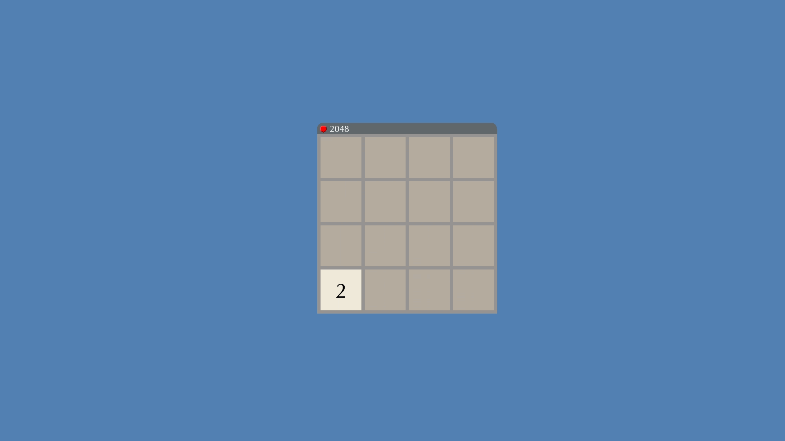
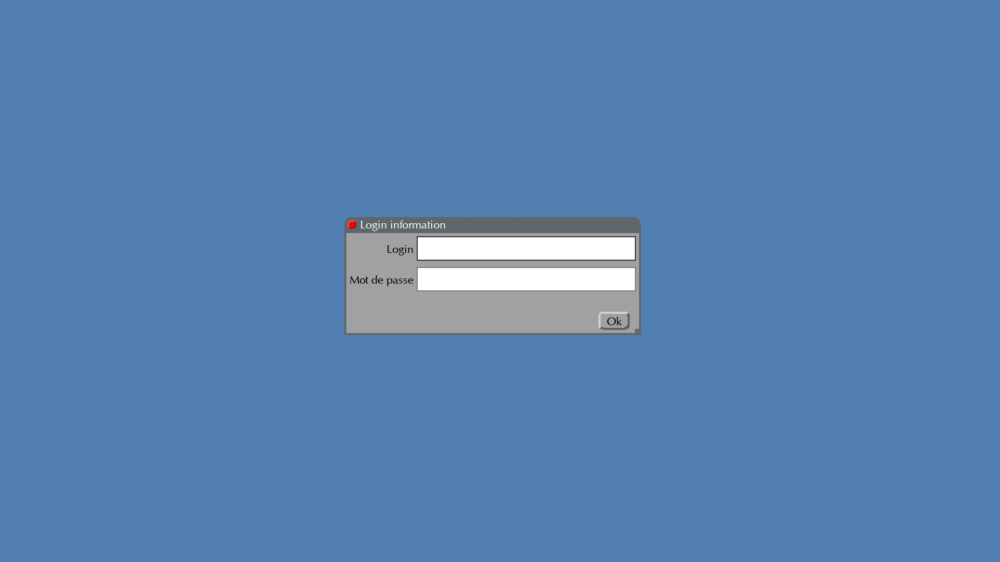
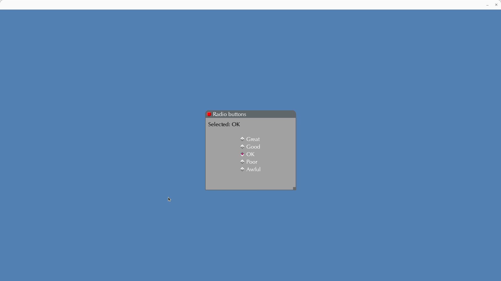

[](README.md)

<details>

<summary>Sommaire</summary>

1. [Librarie Graphique](#librairie-graphique)
2. [Installation et configuration](#installation-et-configuration)
2. [Screenshots](#screenshots)
2. [Contact](#contact)

</details>

# Librairie Graphique


Ce projet est mon projet de fin de semestre réalisé par groupe de 3 pendant 1 mois durant ma 1ère année en école d'ingénieur. Le but de ce projet était de coder une librairie graphique qui permettrait aux utilisateurs de créer leurs propres interfaces graphiques. Avec cette librairie, des jeux simples peuvent être créés comme le jeu du démineur ou 2048. Plus précisément, nous devions implémenter les fonctionnalités suivantes:
- Divers composants tels que des frames, des boutons, des champs de texte, etc... qui peuvent être instanciés, configurés, positionnés...
- La gestion des événements et des callbacks (clics, appuis sur des touches, etc...)
- Un gestionnaire de géométrie en grille pour organiser les composants dans une grille et la personnaliser
- Un parseur pour créer des interfaces graphiques à partir d'un fichier
- Des tags qui peuvent être ajoutés/supprimés des composants pour personnaliser leur comportement

Pour nous organiser, nous avons divisé les tâches entre nous en utilisant un outil de planification: Trello.


# Installation et configuration

Il faut tout d'abord cloner ce dépôt.

Puis, allez dans le dossier `cmake/` et tapez les commandes suivantes:
```bash
cmake ..
make ei
make all
```

Ensuite, revenez à la racine du projet. Pour lancer une application, tapez simplement:
```bash
./cmake/<application_name>
```

Plusieurs applications se trouvent déjà dans `tests/` mais d'autres peuvent être créées (et doivent être ajoutées à `CMakeLists.txt`)


# Screenshots

  
*Jeu du démineur*

  
*2048*

  
*Puzzle*

  
*Un champ de texte où le texte peut être sélectionné*

  
*Gestionnaire de géométrie en grille pour aligner et redimensionner automatiquement les composants dans une grille selon certaines conditions*

  
*Boutons radios*

# Contact

Email: [quentin.chauvelon@gmail.com](mailto:quentin.chauvelon@gmail.com) 

LinkedIn: [Quentin Chauvelon](https://www.linkedin.com/in/quentin-chauvelon/) 