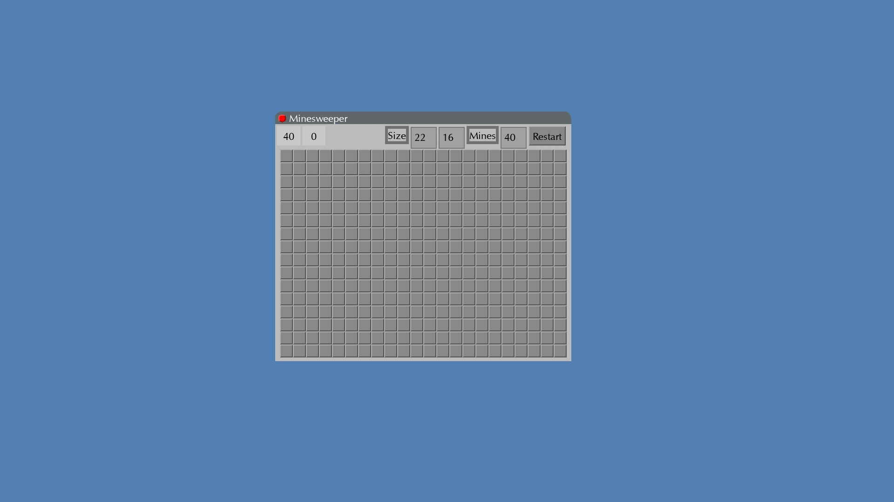
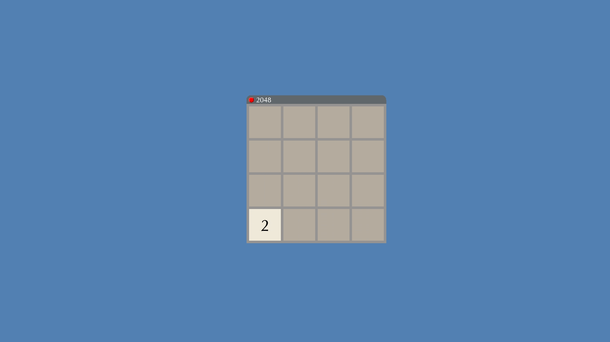
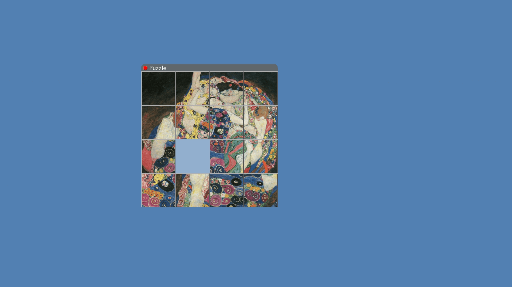
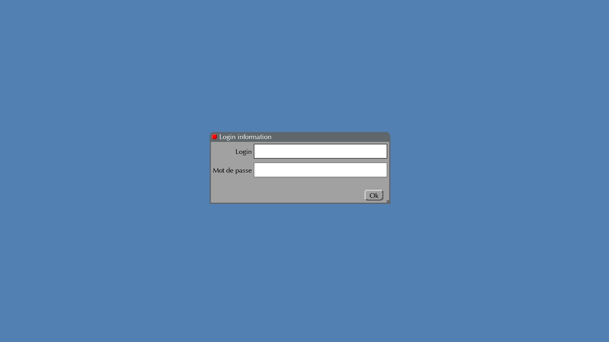
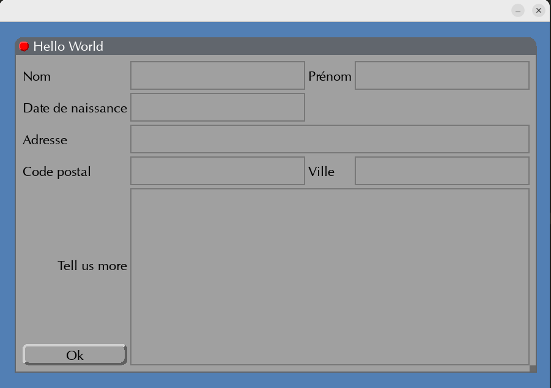
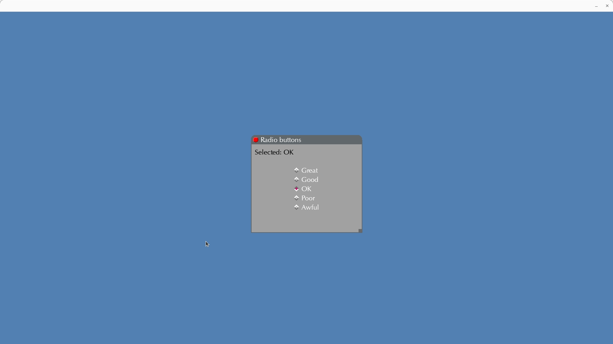

[](README.fr.md)

<details>

<summary>Table of contents</summary>

1. [UI Widget Library](#ui-widget-library)
2. [Installation and setup](#installation-and-setup)
2. [Screenshots](#screenshots)
2. [Contact](#contact)

</details>


# UI Widget Library


This project is my end of term project. I worked on it in a group of 3 for 1 month during my first year of Master's Degree. The goal of this project was to code a widget library in C that would allow users to create GUIs. With this library, simple games can be created like minesweeper or 2048. Specifically, we had to implement the following functionalities:
- Various widgets such as frames, buttons, entries, etc... that can be instantiated, configured, positioned...
- Event handling and callbacks (clicks, key presses, etc...)
- A grid geometry manager to arrange widgets in a grid and customize it
- A Parser to create GUIs from a file
- Tags that can be added/removed from widgets to personalize their behavior

To organize ourselves, we divided the tasks among us using a planning tool: Trello.

# Installation and setup

First, clone this repository.

Then, navigate to `cmake/` and type the following commands:
```bash
cmake ..
make ei
make all
```

Next, navigate back to the root of the project. To launch an application, simply type:
```bash
./cmake/<application_name>
```
Various applications can be found in `tests/` but more can be created (and must be added to `CMakeLists.txt`)

# Screenshots

  
*Minesweeper*

  
*2048*

  
*Puzzle*

  
*A text field with text that can be selected*

  
*Grid geometry manager to align and size widgets automatically in a grid layout following some constraints*

  
*Radio buttons*

# Contact

Email: [quentin.chauvelon@gmail.com](mailto:quentin.chauvelon@gmail.com) 

LinkedIn: [Quentin Chauvelon](https://www.linkedin.com/in/quentin-chauvelon/) 
